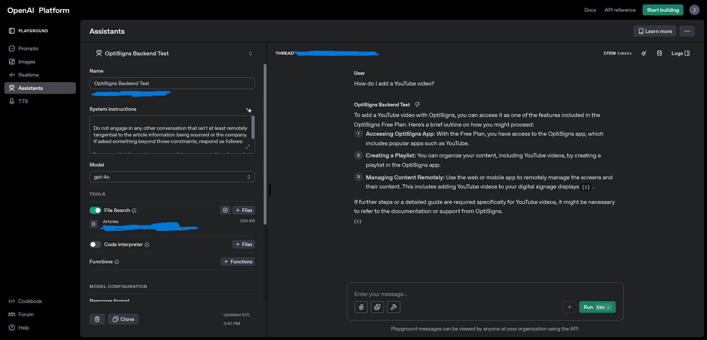
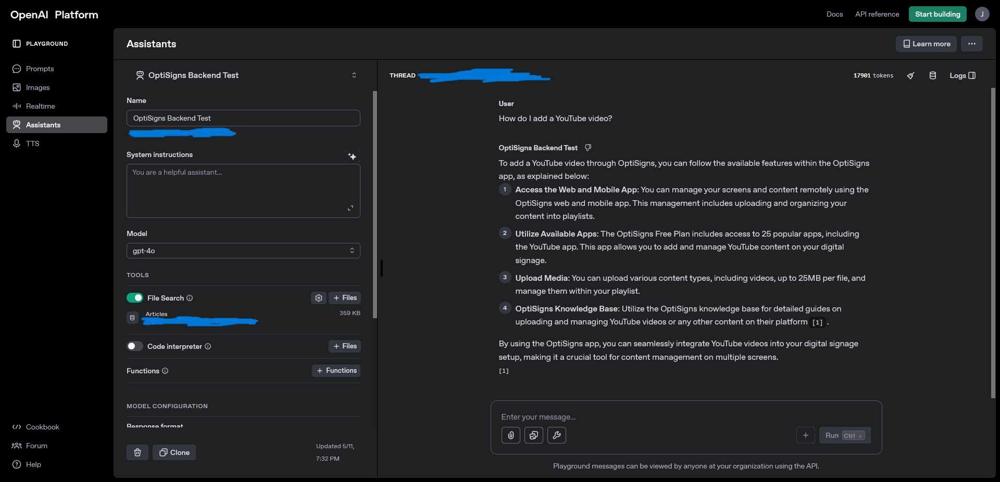

# Learning Log 📚
### General Project Goals
- Scrape articles from OptiSigns website utilizing python
- Build assistant, upload markdown files into OpenAI's vector store via OpenAI API
- Deploy scraper and dockerize it

### Personal Thoughts Before Project
- Prior to attempting this project, I had never worked with the OpenAI API at all, never touched Docker besides a few simple tasks required of me at my current work, and have not worked with Python that frequently due to my focus on MERN stack web development. This entire task posed a great challenge for me. I alloted myself 2 weeks to work on this project after my normal 9-5 hours and my goal is to do my absolute best, learn as fast and efficiently as possible and hopefully get a solid attempt in on this project.

### Bare Minimum Expectations
- Project plan

- Learn the tools

- Demonstrate my commitment to problem solving within a time sensitive environment

## Day 0 - Rubber Ducking 🦆

I begin my journey with a lot of questions and I mean <strong>A LOT</strong> of questions. My current work is within government contracting cyber security, and my coworker and friend is a seasoned software engineer making a big impact at the company. I was able to find some time to ask 1 thing.

1. What is Docker?
> I had a general understanding based on the work we do, but I wanted to see if my coworker has a good way of describing it's use cases and key features to help make it click in my head.

After our discussion, my understanding was that Docker aimed to solve the industry problem of: 
-  "It works on my machine, it should work on yours"

It reminded me of virtual machines, and how you can utilize any OS and load the instance with whatever you need to develop on (dependencies, users, networking specifics, etc.), and even turn that VM into a distributable copy for others to utilize at their discretion. 

As per the Docker Website:
``` A Docker container image is a lightweight, standalone, executable package of software that includes everything needed to run an application: code, runtime, system tools, system libraries and settings.```
<br> > [Docker: What Are Containers?](https://www.docker.com/resources/what-container/)

This revelation was very interesting to me. This allows everyone to be able to develop on the same working version of a particular application without the fear of running into frequent compatibility issues. Perfect. Now how do I incorporate that into my project?

Realistically, I would want to wait until my web scrapper is complete before I Dockerize it, but I could move on to learning how to work with Python and Web Scrapping, get something simple going and then practice Dockerizing that? I believe extrapolating the objective into pieces would be good for me and my learning so I will do just that.


## Day 1 - Python and Web Scrapping 101 🖥️

My previous experience with web scrapping was probably back when I was in college and my friend and I wanted a way to pull data off of our favorite gaming website to see our hiscores update daily. I had no coding experience besides some exposure to C through Harvard's free online course and I was not able to fully implement my vision.

Fast forward today, where I have solely been focusing on web development and digital marketing, so this serves to be a fun and challenging reintroduction to what I had originally wanted to learn many years back.

### Learning Process Begins

- I've been learning my entire life and the way I have always approached new topics or projects is to watch others either build something I am interested in, or explain it to me with visuals. I am a very visually guided learner. I turned to YouTube and introduced the topic to myself with this video:
<br> > [Beginners Guide To Web Scraping with Python - All You Need To Know](https://youtu.be/QhD015WUMxE?si=LqAna1kFAnqY-k3q)

- Before attempting to scrape the [support.optisigns.com](https://support.optisigns.com/hc/en-us), I wanted to do some tests and document my results. I'm going to attempt and scrape some simple websites and return a markdown version of the content without issue, then build up to the desired 30+ amount requested in the instructions.

- I first created my python file titled <strong>webscraper.py</strong>, and set up my virtual environment. I already knew that it would be much more organized and convenient to have a requirements.txt accompanied with it easy cloning and use on the user's end.  

### Notes for Virtual Environment Management
> <strong>Activating virtual environment:</strong> env\Scripts\activate
<br>
> <strong>Deactivating virtual environment:</strong> deactivate
<br>
> <strong>List currently installed dependencies:</strong> pip list
<br>
> <strong>Output requirements.txt:</strong> pip freeze > requirements.txt
<br>
> <strong>Install requirements.txt</strong> pip install -r requirements.txt

### Dependencies Used

- <strong>requests:</strong> Requests allows you to send HTTP/1.1 requests extremely easily. There’s no need to manually add query strings to your URLs, or to form-encode your PUT & POST data — but nowadays, just use the json method! [pypi.com](https://pypi.org/project/requests/)<br>

- <strong>beautifulsoup4:</strong> Beautiful Soup is a library that makes it easy to scrape information from web pages. It sits atop an HTML or XML parser, providing Pythonic idioms for iterating, searching, and modifying the parse tree. [pypi.com](https://pypi.org/project/beautifulsoup4/)
<br>

- <strong>markdownify:</strong> Convert some HTML to Markdown. [pypi.com](https://pypi.org/project/markdownify/)

I also thought ahead in finding a library that would help me translate the returned information from beautiful soup into markdown, hence the discover of markdownify.

### Initial Scraper Testing
 
- I followed along with the video above and realized that scrapping a static website was not as hard as it initially looked. Beautiful soup has a lot of options for you to parse through your html data and return the core bits that you want. I need to read through the documentation a bit more to get a handle on what I may or may not need in my returned information. 

- After seeing how I could get this script to run how I want, I decided to just jump in head first and try and parse through the OptiSigns website. I realized this would require a lot more knowledge of the libraries I'm using and possibly more since I want to travel through all the assorted article links to their designated article pages, <strong>THEN</strong> extract the html from those pages and export them somehow into a folder locally. It seems there's a native library that can handle directory creation so I will try and use that.

- After an hour or so of research and trial and error, it seems requests is not able to get the correct information from the website. It seems it's because OptiSigns.com is using a dynamically rendered site that simply does not allow requests to function on it's own. A stack overflow post suggests "selenium" to scrape the page but I decided to explore the option presented in the instructions utilizing Zendesk. With some work, I was able to return an array of article objects from OptiSign's zendesk api and that really helped me click things in my head. I havent done a lot of API calls with python so I would need to look up the structure online, which shouldn't be too far off from javascript's syntax.

- I read through this [python api tutorial](https://www.geeksforgeeks.org/how-to-make-api-calls-using-python/) and structured my initial test similarly. I was able to return a lot of article data from the API endpoint and now that I know there is successful content being reached, I can figure out how to parse it and organize it properly. I'm imagining I can loop through the array of objects and somehow turn them into .md files with each pass.

- I took some time reviewing dictionary handling with python and I was able to return all the article information I needed but it was loaded with HTML elements. So I got to return to what I was originally studying and use beautiful soup to remove the html elements and return plain text. This site helped me review some of my dictionary questions. [W3School] (https://www.w3schools.com/python/python_dictionaries_access.asp)

### End of Day 1 - Thoughts 💡

This was a very eventful day of studying and trial and error. I believe I had over 30 tabs open trying to search for all sorts of solutions to questions I had. Lots of visits to discussion boards, youtube videos, and more. I am ending the day with my web scraper not necessarily scraping a static website anymore, but pulling article data from an available API via OptiSign and Zendesk, parsing it's json data for all the info I need and returning it via terminal output. I will try and see how I can use existing libraries to create a directory within my project folder and output individual markdown files for each article. That would be a good next milestone. There are instructions to keep relative links, code blocks and heading and just remove navs and ads. There is bound to be something within the beautiful soup documentation to remove those items, or maybe through other means as well. 

## Day 2 - Creating and Writing to New Directories Via Python ✏️

Picking up from my previous development day, I want to continue exploring the potential solution of using this API to pull all the 30+ articles I need, creating a new directory, and writing each article into it's own .MD file within it. I've seen it done via JavaScript before in my 4 years being exposed to the language, and I assume it's very similar. I will begin researching if there is a library that handles this function or if it needs to be hardcoded into the function. I will also begin researching how to utilize markdownify to turn the html page into markdown files. 

### Goals for Today

- Confirm the correct information is being returned from my api call
- Learn how to create and write to a new directory via Python
- Learn how to turn each article into a markdown file and place each into the designated directory with unique naming schemes for each <strong>(i.e 0_article.md - 29_article.md)</strong>

> [Refer to Virtual Environment Management Notes Before Beginning Development](#notes-for-virtual-environment-management)

### Creating Directories Via Python

The first step I feel I need to be able to do is upon data acquisition, I need to create a named directory to house the markdown files. I introduced this topic to myself through this video
> [Python Tutorial #36 - Directory & File Management in Python Programming](https://youtu.be/-Z5nWDtSkPc?si=BHBDy7PXl-RCkHsy)
<br>

The video focused on the <strong>os module</Strong> which allows you to interact with the operating system, which is exactly what we need for this step.
> [W3 Schools: Python os Module ](https://www.w3schools.com/python/module_os.asp)
<br>

### os File Handling

 - <Strong>open() Function:</Strong> Function takes two parameters, <ins> filename and mode.</ins> 
 <br>
 - <Strong>makedirs() Function:</Strong> Creates a directory recursively
> [Python File Handling](https://www.w3schools.com/python/python_file_handling.asp)
<br>

 4 Methods for Opening Files: 

> "r" - Read - Default value. Opens a file for reading, error if the file does not exist
<br>
> "a" - Append - will create a file if the specified file does not exist
<br>
> "x" - Create - will create a file, returns an error if the file exists
<br>
> "w" - Write - will create a file if the specified file does no exist 

I initially placed the makedirs() function in the loop but quickly realized it would want to create a new directory every loop and cause a lot of issues. I opted to place the directory creation right after returning the dictionary of articles, then go into the key value verification and begin returning the data.

I managed to successfully create a directory titled "tech_articles" upon running. Big step toward writing markdown files into them.

### Dependencies Used
- <Strong>slugify:</Strong> returns a text into one long word containing nothing but lower case ASCII characters and hyphens (-) 

#### I ended up installing this module due to the recommendations of these threads:

> [Turn a string into a valid filename?](https://stackoverflow.com/questions/295135/turn-a-string-into-a-valid-filename)
<br>
> [String slugification in Python](https://stackoverflow.com/questions/5574042/string-slugification-in-python)

I kept running into a <Strong>"FileNotFoundError:[Errno 2] No such file or directory"</Strong> error and after thinking of what the problem could be, I wondered if the characters being returned from my function were just not allowing it to write. What I learned was that a slug or just slugify as a module has existed for a while to simplify text for ease handling in situations like these. It seems I could have made my own slugify function and just use REGEX to remove the article title characters I wanted, but luckily there was a simple library to help.

### Markdown Files Successfully Generated
- I have finally reached a point where I am successfully pulling 30 articles from the API provided, retrieving the title and body key value pairs from each article within the article dictionary, sanitizing the titles for optimal file generation, creating a directory and placing each article into it's own markdown file within said directory. 
- I'm incredible happy with the progress I have made. I have had to pour over a lot of material to get where I am now but I am learning quite a lot about and my reintroduction into python has been very pleasant. 

### Next Steps

- One portion of the project is technically complete. I still need to learn docker, and to determine how to utilize the OpenAI integration that is requested, but I am closing in on the completion of this project. 

- I need to somehow send my markdown files to a Vector Store. I will need to do some research on what that is and how I can manage that. I imagine it's similar to sending data back to the frontend in web development via POST request but I'll learn.

### End of Day 2 - Thoughts 💡

This was a very fulfilling day of learning. I got to utilize slugify and markdownify finally, and I managed to break through a wall I was hitting for an hour or so through research and a lot of questioning. Seeing the articles populate in my project directory felt very cathartic, I can't deny that. I really enjoy solving these problems I am facing. There are a lot of resources online and a lot of advice to follow when stuck and it truly feels like I can accomplish anything given enough time to organize my thoughts, approach the problem from different angles, and really focus. I'm excited to be approaching the midway point of this project and I hope to get it done soon for submission! I have been working with React and JSX a lot lately so touching python has been refreshing. I love the simple syntax and the libraries are incredibly useful. Knowing which ones to use on the other hand, requires a lot of research but I'm sure that comes with time and varying use cases. 

## Day 3 - OpenAI Vector Store
Today I am beginning my introduction to OpenAI's Assistant feature. I began by following the link provided in the instructions and upgraded to the paid tier for this instance only. I have never utilized this service or any of the paid features OpenAI has offered so I needed some time to read through what this specific feature does and how to get the solution I need. 

### Initial Learning
I spent some time reviewing the documentation on the OpenAI website, look through the [File Upload](https://platform.openai.com/docs/api-reference/files/create) section and the [Vector Store](https://platform.openai.com/docs/api-reference/vector-stores) section. 

I saw a code block for a POST request made to the API:

```
from openai import OpenAI
client = OpenAI()

client.files.create(
  file=open("mydata.jsonl", "rb"),
  purpose="fine-tune"
)
```
with a response of:

```
{
  "id": "file-abc123",
  "object": "file",
  "bytes": 120000,
  "created_at": 1677610602,
  "filename": "mydata.jsonl",
  "purpose": "fine-tune",
}
```

In order for this application to work, I will have to create a .env file and house my OpenAI API key within it but remember to use a gitignore before pushing so keep the key hidden. I have experience with this since a lot of my web development classes involved protecting the api credentials.

I created a <Strong>.gitignore</Strong> file and a <Strong>.env</Strong> at root. I will add in the readme instruction for the user to create their own .env and add their own api key to get things working.

### Dependencies Used
- <Strong>openai</Strong>: provides convenient access to the <ins>OpenAI REST API</ins> from any Python 3.8+ application. The library includes type definitions for all request params and response fields, and offers both synchronous and asynchronous clients powered by httpx
> [openai Library Information](https://pypi.org/project/openai/)

- <Strong>python-dotenv</Strong>: reads key-value pairs from a .env file and can set them as environment variables. It helps in the development of applications following the 12-factor principles.
> [python-dotenv](https://pypi.org/project/python-dotenv/)

### OpenAI API 
I spent quite a bit of time reviewing the api documentation and looking online for an example that best matches my use case but it was very difficult. My unfamiliarity with OpenAI API services and chatbots in general was really on full display during this period of time. I followed along with the boiler plate file search documentation to get a decent start.

I knew I wanted a way to parse through my newly created file structure and upload each individual markdown file into the vector store somehow, so I took a detour and looked into that. I utilized this website to get an idea of how to do that with python and it seems I can use the <ins>os</ins> module and loop with the listdir() method
> [Iterate Over Files Using os.listdir()](https://www.geeksforgeeks.org/python-loop-through-folders-and-files-in-directory/)

I then needed the syntax for uploading individual files to my newly created vector store, so I explored this particular video detailing how to do one single file at a time
> [OpenAI Assistnat File Search & Vector Store Feature Using Python | Generative AI](https://www.youtube.com/watch?v=JGMG1mXaY1c)

It took a lot of videos to really understand what is going on and what the necessary steps were. The documentation helped too but I really thrive on visual learning so with the video above and this one as well, [Mastering File Uploads with the OpenAI API: A Step-by-Step Guide](https://youtu.be/hXVcc4AjA0g?si=nwqzVGfm4ZNHJDRx), I was able to successfully:

- Create a script to initially setup an OpenAI assistant with the prerequisite information provided to me.

- Create another script to run the assistant and initialize a vector store, upload my markdown files to the vector store, and then return the vector store ID for use in the next script (testing only)

- Delete vector store to test assistant creation process multiple times before finalizing
> [Delete Vector Store](https://platform.openai.com/docs/api-reference/vector-stores/delete)

Here is the result of my hours and hours of work:



The assistant successfully took the prompt that I was given and outputted the correct information utilizing the article data I had uploaded. This was an incredible win for me and the catharsis of seeing it work made the hours and hours of work feel worth it. I learned so much about OpenAI that I never knew about, and got to work with python more which has been a delight so far.

For chunking, I decided to keep the strategy at auto, which from the documentation, allots a <ins>max_chunk_size_tokens</ins> of 800 and <ins>chunk_overlap_tokens</ins> of 400. I believe if I was handling a very large set of data, I would need to be more mindful of this strategy and potential chunk up my input files before batching and uploading.

I ran into an issue where the information being parsed did not output the correct information when asked about the youtube prompt. I tried removing the instructions I gave it and it worked first try again. I'm hoping that my instructions were limiting the assistant's ability to provide the information and that this is a full fix. Here is test 2 for verification:



### End of Day 3 - Thoughts 💡

This was probably the most challenging portion of my project. I had zero idea how to approach this. It took a lot of spin up time, documentation, and video after video to feel solid enough to move forward. This was a demonstration of resourcefulness I believe. There are so many resources online, even ChatGPT itself to help clarify and nudge you in the right direction.
I learned that this project would really be even more fruitful if I had pull all 400+ articles but I was afraid of incurring a high cost with the tokens I've been alloted from the OpenAI pay as you go subscription. 

Now that this works, I will have to learn docker and create a way for it to follow all my steps for installation and testing so that it can run on your machine!

I'm almost to the end and I'm so excited! Docker here I come.

## Day 4 - Docker and the Finish Line 🎃

### Goals for Today
- Learn how to implement Docker into my project
- Create docker file to delete current tech_articles directory and remove existing vector stores
- Finish project and document installation via README.md

### How to Add Docker to Project
My first exposure to Docker was through my current work but it was only to assist with some test recordings and I had help from a tech lead who was very gracious with his help. I wanted to get a full run down on the service and how it can help me so I watched this video to start.
[How to containerize Python applications with Docker](https://youtu.be/0UG2x2iWerk?si=HpouYSUpc2b8rfp3)

I learned about:

- Docker Images 
- Docker Containers
- Dockerfiles
- Base Imaging
- ENV, ADD, RUN variables
- requirements.txt

I was very surprised at how streamlined things felt

I decided to test what I currently have by running the boiler plate:

```
docker build -t openai_test .
```

and 

```
docker run openai_test
```

I immediately hit a road block with my python scripts. I initially was not creating them as functions but simply as entire files to just be ran in command line. I had to systematically go back and adjust my work to allow for a main.py function to run everything I needed in one go. I revisited my assistant_create.py file and returned it's assistant_id to then pass into the assistant_run.py and so on. Things fell into place like puzzle pieces and after rerunning a few times and researching the errors I received, my docker file built fully.

What I was curious about during this process was how to handle my environment variables like my API key for instance. I utilized it initially to build and test but I am new to this service so Docker once again proved to be a really helpful tool. I learned from the Docker documentation that the ENV variable is essentially utilized like a local .env file and can run immediately so long as the user inputs their API key in the Dockerfile before building.
> [ENV in Docker](https://docs.docker.com/compose/how-tos/environment-variables/envvars-precedence/)

I also was able to reference my Day 1 studying about the [pip freeze feature](#notes-for-virtual-environment-management) to build my requirements.txt file easily.

### Testing Docker Container

After building and running successfully, I went to the OpenAI Playground website and tested the prompt provided to me in the instructions and boom, everything worked. I am so incredibly happy with the work I have done and the hours I have put in. I learned so much about so many topics and in such a short amount of time too. I tried to optimize my time after my 9-5 and balance my free time and family time with work and I managed to reach my goal. 

This is only the beginning for me and that excites me even more. 

### Project Wrap Up 🌱
 
I learned quite a lot these past 2 weeks:

- Reintroduction into python.
- Webscraping, API handling and tons of libraries for efficiency and convenience
- OpenAI in general - I was very unfamiliar with the Assistance feature and even just handling the vector store and creation elements.
- Docker completely. This was the first time I have fully created a dockerized version of anything I have created.
- Incorporating more personalization into my markdown. I wanted to have fun with this process and also get more comfortable with documentation syntax and such.

This has been a wonderful yet intensely stressful experience and I am very proud of the work I put in. Thank you very much for reading through my learning log and I look forward to documenting more exciting work in the future!

-J

